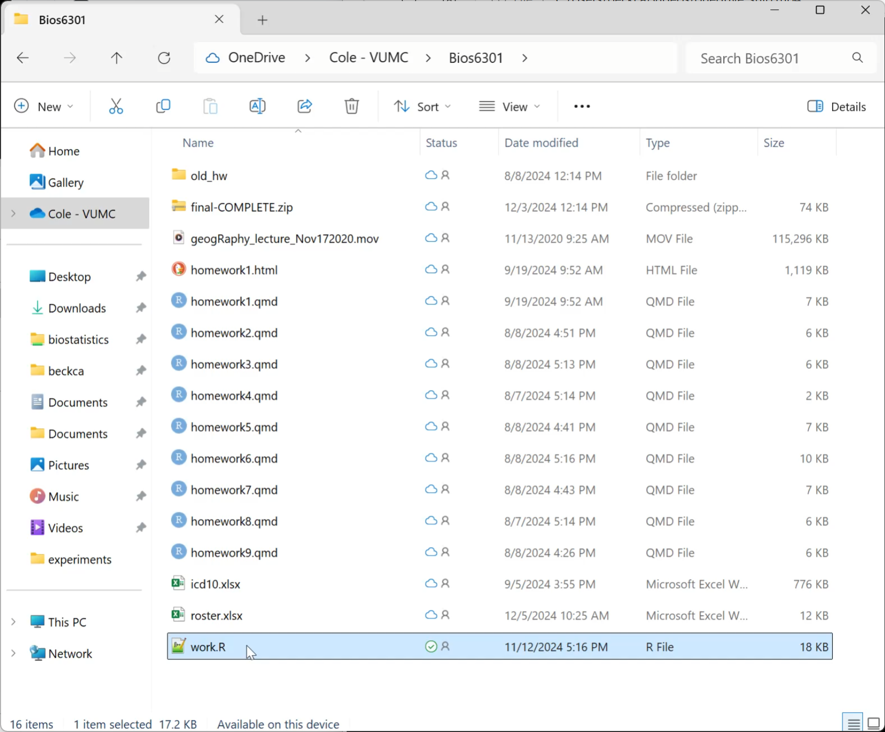
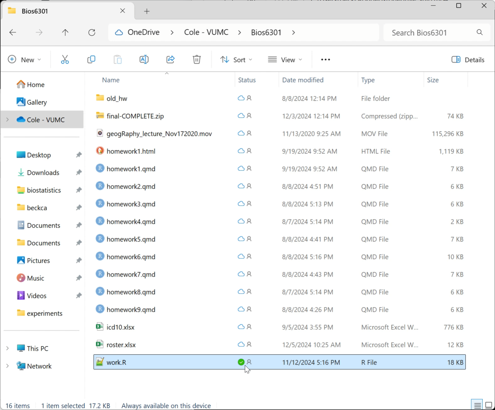
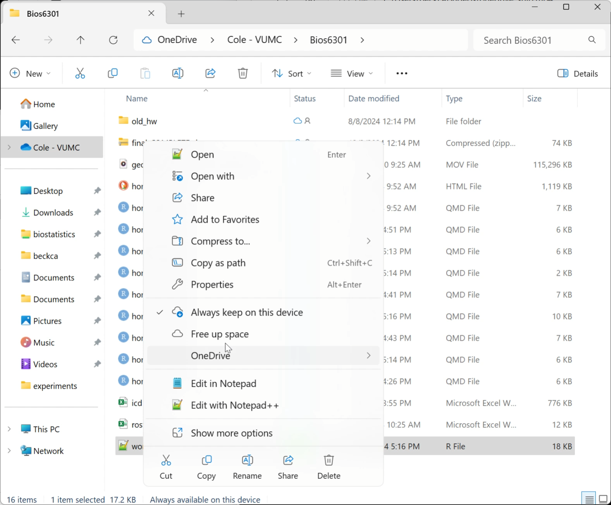

# OneDrive2R

Load shared data directly from OneDrive to R.

This is not published to CRAN at present. To install please use:

`devtools::install_github('vubiostat/OneDrive2R')`.

## Example

```
library(OneDrive2R)
library(Microsoft365R)
drive <- get_business_onedrive(auth_type="device_code")
names(shared(drive)) # Look at top level of shared files
data  <- read.shared(drive, "/SomeDir/sharedata.csv")
```

## Terms

* OneDrive  
One's personal cloud storage provided by Microsoft. Tied to your login email.
* SharePoint  
An organization's presence for content, collaboration, workflows, team sites. The term also refers to the to browser-based app to access Microsoft365 tools.
* Shared File  
A file shared to you from OneDrive or SharePoint.
* Sync  
When a file is set to 'sync', it gets written locally to the drive. If another copy is changed, this one gets the updates written to it. By default a file is not set to 'sync', but the first time one access the file it automatically sets the file 'sync'.
* Mount / Mapping  
When a file or directory is 'mounted' or 'mapped' this allows the files to appear locally, under a drive such as "C:\".

New files from the cloud are online-only by default, not taking up disk space. Files are downloaded to the device if a user opens them or chooses the option to “Always keep on this device” from the context menu in File Explorer.

## FAQ

### _Why would I want to do this when OneDrive copies data locally?_

Having confidential data containing private health information (PHI) or private identifying information (PII) on a portable computing device is a security risk.
Some institutions even mandate by policy that PHI/PII are never stored on a portable computing device. At odds with this is when Microsoft OneDrive/SharePoint is an approved method of data storage and access because by _default_  any data access locally writes it to disk! This is a seemingly impossible to comply with situation when needing to analyze confidential data in a secure manner using R when it's stored in OneDrive.

This package loads the data directly into memory in an R environment. Giving the user peace of mind about utilizing good security practices around sensitive data and keeping it off disk.

### _How do I find the path to shared file?_

Read the documentation for the read function: `?read_azure`. 

### _How do I tell if files are mapped locally from SharePoint?_

Now that one is aware of the danger, how can one tell if it is getting written locally? 

The simplest is if one can load it on Windows using a letter drive path, then it is stored locally. 

Look for the green check or filled green circle on the file to see that 
OneDrive is writing the file locally.





The Cloud Icon displays when 'sync' is turned off and it is not writing 
the file onto the local drive. This is done by selecting "Free up space".



### _Is there anything else I should do?_

R asks when exiting if one should save the session to disk. This is equivalent once again to writing sensitive data to disk, and is a bad security practice. It is recommended to disable this feature globally to prevent accidentally spooling of PHI/PII to disk. 

For base R the following can be ensured using `usethis::edit_r_profile()` and adding this code:

```
newfun <- function (save = "no", status = 0, runLast = TRUE)
  .Internal(quit(save, status, runLast))
pkg <- 'base'
oldfun <- 'q'
pkgenv <- as.environment(paste0("package:", pkg))
unlockBinding(oldfun, pkgenv)
utils::assignInNamespace(oldfun, newfun, ns = pkg, envir = pkgenv)
assign(oldfun, newfun, pkgenv)
lockBinding(oldfun, pkgenv)
```

For [RStudio](https://posit.co/downloads/) users, "Tools > Global Options > General > Workspace > Save Workspace to .RData on exit" should be set to Never. 

### It doesn't support my needs for XXX easily

Please open an [issue](https://github.com/vubiostat/OneDrive2R/issues) and ask for that. This package exists because of requests! 

## License

`OneDrive2R` A method to read OneDrive files directly into R memory

Copyright (C) 2024-2025 Shawn Garbett, Cole Beck, James Grindstaff, Lauren Samuels, Vanderbilt University

This program is free software: you can redistribute it and/or modify
it under the terms of the GNU General Public License as published by
the Free Software Foundation, either version 3 of the License, or
(at your option) any later version.

This program is distributed in the hope that it will be useful,
but WITHOUT ANY WARRANTY; without even the implied warranty of
MERCHANTABILITY or FITNESS FOR A PARTICULAR PURPOSE.  See the
GNU General Public License for more details.

You should have received a copy of the GNU General Public License
along with this program.  If not, see [http://www.gnu.org/licenses/](http://www.gnu.org/licenses/).
